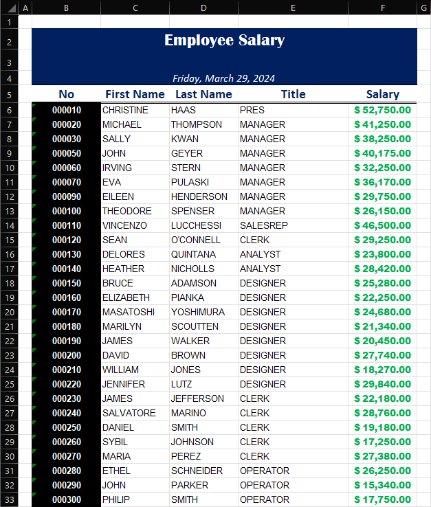

import { Aside } from '@astrojs/starlight/components'

Integrating IBM i applications with Excel can greatly enhance reporting and data analysis capabilities. This post explores how to automate the process of generating Excel reports from IBM i's DB2 data using Python and openpyxl, focusing on inserting data into a pre-designed template.

<Aside type="tip">

    **Choosing the Right Library for Excel Automation in Python**

    - **xlsxwriter**: Known for its ability to create complex Excel files from scratch, `xlsxwriter` shines in scenarios requiring extensive formatting, charting, and file creation. The major limitation is its inability to read or modify existing Excel files, which can be a drawback if working with pre-designed templates.

    - **openpyxl**: This library supports reading and writing Excel 2010 xlsx/xlsm/xltx/xltm files, making it a versatile choice for tasks that require modifying existing templates or creating new files from scratch. It strikes a good balance with features to manage formulas, styles, and charts effectively.

    - **pandas**: A powerhouse for data manipulation and analysis, `pandas` excels at quickly exporting DataFrames to Excel files. While it relies on `openpyxl` or `xlsxwriter` for the actual file writing, `pandas` itself offers limited support for Excel's styling and formatting capabilities. It's best used for its data handling strengths rather than complex Excel file creation.

    `openpyxl` is chosen for its ability to work with existing Excel templates and comprehensive features for file manipulation.

</Aside>

## Setting Up Your Environment

Ensure `openpyxl` is installed:

```bash
pip3 install openpyxl
```

## Preparing Your Excel Template

Create an Excel template with headers, colors, and formulas.

_Example Template ([`openpyxl_template.xlsx`](../../../../openpyxl_template.xlsx)):_


## Python Script for Generating Reports

This script fetches data from the `SAMPLE.EMPLOYEE` table and populates the Excel template.

```python
import argparse
import openpyxl
import ibm_db_dbi
from copy import copy

def copy_cell_formatting(source_cell, target_cell):
    """
    Copies all formatting from source_cell to target_cell.
    """
    target_cell.font = copy(source_cell.font)
    target_cell.border = copy(source_cell.border)
    target_cell.fill = copy(source_cell.fill)
    target_cell.number_format = copy(source_cell.number_format)
    target_cell.protection = copy(source_cell.protection)
    target_cell.alignment = copy(source_cell.alignment)

def generate_report(template_path, output_path, data_start="A1"):
    # Load the workbook and select the active worksheet
    wb = openpyxl.load_workbook(template_path)
    ws = wb.active

    # Connect to the database
    conn = ibm_db_dbi.connect()
    cursor = conn.cursor()

    # Execute the query to fetch employee data
    sql = "SELECT EMPNO, FIRSTNME, LASTNAME, JOB, SALARY FROM SAMPLE.EMPLOYEE"
    cursor.execute(sql)

    # Parse the data_start to get row and column correctly for any column
    column, row = data_start[0], data_start[1:]
    start_row = int(row)
    start_col = openpyxl.utils.column_index_from_string(column)

    # Insert data into the worksheet starting from data_start
    for row_index, db_row in enumerate(cursor, start=start_row):
        for col_index, value in enumerate(db_row, start=start_col):
            # The template cell for formatting is in the first row (data_start row)
            template_cell = ws.cell(row=start_row, column=col_index)
            target_cell = ws.cell(row=row_index, column=col_index, value=value)
            # Copy formatting from the template cell to the new cell
            copy_cell_formatting(template_cell, target_cell)

    # Close the database cursor and connection
    cursor.close()
    conn.close()

    # Save the modified workbook to the specified output path
    wb.save(output_path)

if __name__ == "__main__":
    parser = argparse.ArgumentParser(description="Generate an Excel report from DB2 data.")
    parser.add_argument("template_path", help="Path to the Excel template file.")
    parser.add_argument("output_path", help="Path where the output Excel file will be saved.")
    parser.add_argument("--data-start", default="A1", help="Cell position where data insertion begins (e.g., 'A6').")

    args = parser.parse_args()

    generate_report(args.template_path, args.output_path, args.data_start)
```

## Running the Script

Execute the script to generate your report:

```bash
python3 generate_employee_report.py /tmp/openpyxl_template.xlsx /tmp/openpyxl_output.xlsx --data-start B6
```

_Example Output ([`openpyxl_output.xlsx`](../../../../openpyxl_output.xlsx)):_


## Conclusion

Automating Excel report generation with `openpyxl` simplifies creating dynamic, data-driven reports, enhancing business processes and decision-making.